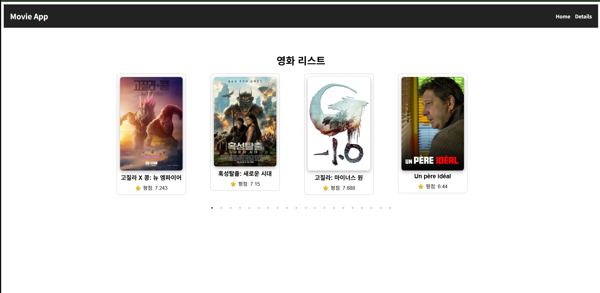

## [mission-1] 1단계 미션 구현 - 이원희/3팀

## 구현 사항
- MovieDetai.jsx로 세부 페이지 구현
- Layout.jsx로 전체 레이아웃 구성
- NavBar.jsx로 상단 바 구성
- main.jsx로 여러 레이아웃 및 라우터 활성화 및 렌더링
- MovieCard.jsx로 내용 만들기
- styles 폴더로 모든 css 분리(정리 및 가시성 향샹)

## 어려웠던 점
- silder 도전과제 시 그림자 표현같은게 출력되지 않는 점을 수정하느라 검색에 시간을 소모했음

## 구현 이미지
